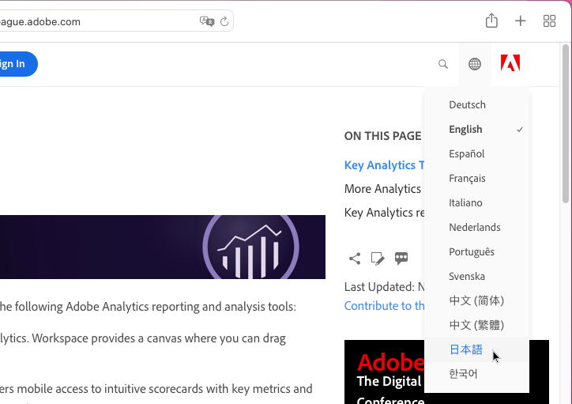
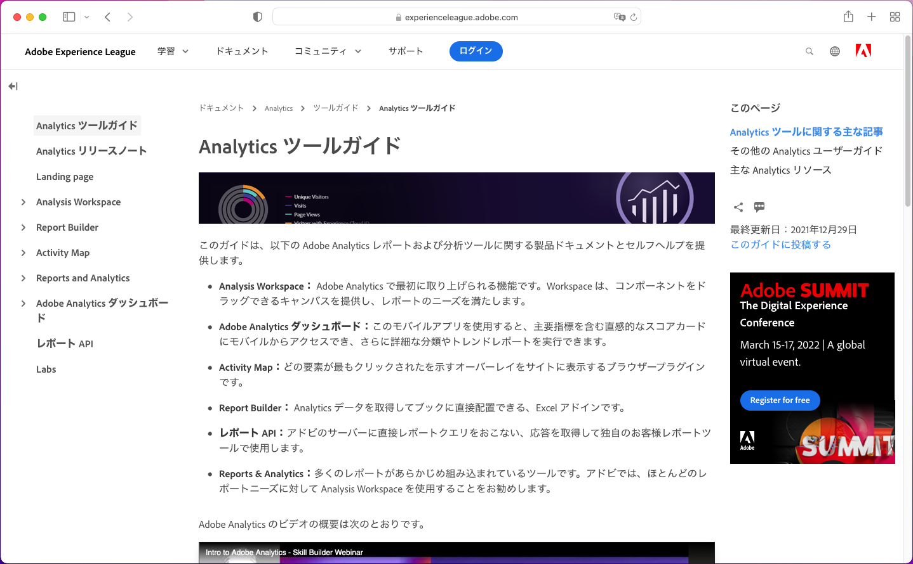
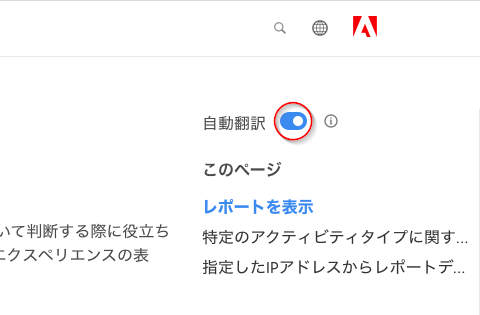
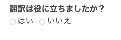

# Adobe Experience Cloud 製品ドキュメントの言語サポート

アドビでは、製品のドキュメント、ヘルプ、およびサポートコンテンツをアドビ製品でサポートされる言語で利用できることが、お客様にとって重要であることを認識しています。この目標を実現するために、アドビでは、お客様が言語を選択し、翻訳されたコンテンツの品質に関するフィードバックを提供できる独自の翻訳体験を提供します。

## 言語の選択

Adobe Experience Cloud 製品ドキュメントは、ほとんどの言語で表示できます。

1. Experience Cloud [製品ドキュメント](https://helpx.adobe.com/jp/support/experience-cloud.html)に移動します。

1. ヘルプページを参照して探します（[Analytics](https://docs.adobe.com/content/help/ja-JP/analytics/landing/home.html) など）。

1. 言語セレクター（地球アイコン）をクリックして、言語を選択します。

   

   選択した言語でページが表示されます。

   

   言語バージョンがまだ利用できない場合、アドビはコンテンツを自動翻訳できます。Adobe の自動翻訳サービスでは、右側のナビゲーションの上部に次のメッセージが表示されます。

   

   コンテンツは選択した言語で自動的にレンダリングされるか、そうでない場合はリンクをクリックして翻訳を開始できます。（このシナリオは、ハイパーリンクをクリックして翻訳ページから英語のソースに戻ると発生する場合があります。翻訳されたページをオンデマンドで表示するオプションが提供されます。）いつでも英語のソースに戻すことができます。

   時折、翻訳が完了する前に、英語のソースコンテンツが最近更新および公開されることがあります。ドロップダウンメニューで言語をクリックすると、ページの上部にある水色の水平バーに、ページが以前のバージョンから自動翻訳されたものであり、更新されたコンテンツが間もなく利用可能になるという通知が表示されます。希望する場合は、新しいブラウザーウィンドウに最新の英語ソースコンテンツを表示することを選択できます。

## 自動翻訳を使用する理由

アドビは、自動翻訳機能を利用して、可能な限りコンテンツの作成時間から間をあけずに、さまざまな言語で製品サポートコンテンツを公開しています。サポートコンテンツは製品の使用に不可欠であるため、熟練した専門家によるコンテンツの翻訳を優先しますが、速度と緊急性が最も重要な場合は自動翻訳を選択する場合もあります。

自動翻訳はインターネット上で広く普及しており、その使用は一般に強力な情報収集ツールとして受け入れられています。ナレッジベースのコンテンツでは自動翻訳が広く採用されており、人間による介入はほとんどないこともあります。近年、大きな技術的進歩がありましたが、自動生成された翻訳には、不正確な言語や意味、および誤りが含まれる場合があります。

### ブラウザー経由での自動翻訳

任意のページを選択した言語に自動翻訳するようにブラウザーを設定している場合、結果の翻訳はアドビページから取得した翻訳とは異なることに注意してください。これは、ブラウザーが提供するサービスがストック翻訳であるのに対し、アドビの翻訳はアドビのスタイルガイドラインと用語に準拠するようにカスタマイズされているためです。最適な自動翻訳結果を得るには、ブラウザー設定でこの特定のサイトのブラウザーオプションを無効にするか、「**翻訳しない**」が表示されたらクリックすることをお勧めします。

### 既知の問題

不完全な翻訳、破損した文字、ページレイアウトの問題など、自動翻訳出力で問題が発生する場合があります。これらの問題は、アドビが使用するさまざまなオーサリング、パブリッシング、または翻訳テクノロジーツールによって引き起こされます。アドビでは、既知の問題を以下にリストするために務めてます。

| **発行 ID** | **説明** | **ステータス** |
|--------------|-------------------------------------------------------------------------------------|------------|
| G11N3558 | 一部の Audience Manager ページは、半分が英語のまま、半分が翻訳されています（フランス語、スペイン語）。 | 開く |

### フィードバック

デフォルトまたはユーザーの操作によってコンテンツが自動翻訳されるたびに、翻訳に関するフィードバックをアドビに提供するオプションがあります。ページ上部の水色の水平バーで、「この翻訳は役に立ちましたか？」という質問に対して「はい」または「いいえ」と答えることができます。アドビはこの価値ある指標を収集し、コンパイルされたデータを分析して、コンテンツの翻訳に関する決定を下します。アドビはお客様のフィードバックを尊重しています。是非とも、ご協力お願いします。

将来的には、問題のログ記録、提案された改善の実施、さらに追加の言語のリクエストなどの形で、より広範なフィードバックを提供できるようにする予定です。これらの機能の一部は、英語のページで既に利用可能になっています。アドビでは、長い目で見れば、この機能が、これらのページでのユーザーエクスペリエンスを向上させるのに役立つと考えています。

<!--

-->

### 翻訳の免責事項

アドビでは、機械翻訳プログラムを使用して、テキストを様々な言語に翻訳しています。コンピューター化された翻訳はリテラル翻訳で、エラーが含まれる場合があることに注意してください。アドビは、提供された翻訳の正確性、信頼性、適時性を保証しません。翻訳された情報の正確性や信頼性への依存によって生じた損失や損害に対して、アドビは一切の責任を負いません。英語と他の言語に違いがある場合は、英語版が優先されます。

翻訳エラーや不正確な情報を報告したい場合は、お問い合わせください。
