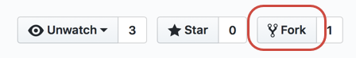

# ドキュメント用のローカル Git リポジトリの設定

この記事では、アドビのドキュメントにコントリビューションするためにローカルマシン上に Git リポジトリを設定する手順について説明します。コントリビューターは、ローカルに作成したクローンのリポジトリを使用して、新規記事の追加、既存記事に対する大きな編集、アートワークの変更をおこなうことができます。

>[!IMPORTANT]
>記事に小さな変更を加えるだけの場合は、この記事の手順を完了する必要は&#x200B;*ありません*。ブラウザー内で Edit アイコンをクリックするだけで、テキストを編集できます。

## 概要

アドビのドキュメントにコントリビューションするには、読み取り／書き込み権限を取得するために、適切なリポジトリを自身の GitHub アカウントにフォークします。その後、対応するドキュメントリポジトリのクローンを作成して、ローカルで Markdown ファイルを作成および編集することができます。作業が終わったら、プルリクエストを使用して、変更を中央の読み取り専用共有リポジトリにマージ（提出）します。

* 適切なリポジトリを特定
* リポジトリを自身の GitHub アカウントにフォーク
* クローンファイルを格納するローカルフォルダーを選択
* ローカルマシンにリポジトリのクローンを作成
* upstream リモートの値を設定

## リポジトリを特定

変更案を保存するための読み取り／書き込み権限を取得するには、適切なリポジトリを自身の GitHub アカウントにフォークします。[!UICONTROL Adobe Experience Cloud] ドキュメントは [github.com](https://www.github.com/adobedocs) の複数の異なるリポジトリ内にあります。

1. 作業対象となるリポジトリがわからない場合は、Web ブラウザーで目的の記事にアクセスします。記事の右上にある **Edit** リンク（鉛筆アイコン）を選択します（Edit リンクが表示されない場合は、そのコンテンツはまだ GitHub 上にありません）。

アドビのドキュメントにコントリビューションするには、対応するドキュメントリポジトリのクローンを作成して、Markdown ファイルをローカルで作成および編集します。作業が終わったら、プルリクエストを使用して、変更を中央の読み取り専用共有リポジトリにマージします。

<!---

If you're new to GitHub, watch the following video for a conceptual overview of the forking and cloning process:

>[!VIDEO https://channel9.msdn.com/Blogs/CoolMoose/Git-Repository-Setup/player]
-->

## リポジトリをフォーク

適切なリポジトリを使用し、そのリポジトリを GitHub の Web サイトから自身の GitHub アカウントにフォークします。

個人用のフォークが必要になるのは、メインのドキュメントリポジトリはいずれも読み取り専用で、リポジトリのコンテンツを直接変更することはできないからです。コンテンツを変更するには、フォークからメインリポジトリへのプルリクエスト（PR）を提出しなければなりません。このプロセスを進めるために、まずリポジトリの作業用コピーを作成して、書き込みアクセスを可能にする必要があります。そのために、GitHub の&#x200B;*フォーク*&#x200B;を使用します。

1. メインリポジトリの GitHub ページに移動して、右上の「**Fork**」ボタンをクリックします。

   

1. フォークの作成先を指定するよう求められたら、自分の GitHub アカウントのタイルを選択します。これにより、自分の GitHub アカウント内にリポジトリのコピー（フォーク）が作成されます。

1. 覚えやすく、入力しやすいフォルダー名を選択します。

   サイズが大きいリポジトリもあるので、十分なディスク容量のある場所を選択するようにします。

   >[!NOTE]
   >
   >別の Git リポジトリのフォルダーの下層にあるローカルフォルダーパスは選択しないでください。Git のクローンフォルダー同士を同じ階層に並べることは問題ありませんが、他の Git フォルダーの下層に配置した場合はファイルのトラッキングでエラーが発生します。

## リポジトリのローカルクローンを作成

フォークされたリポジトリのクローンを作成することで、自分のコンピューターにファイルのコピーをダウンロードできます。編集が終わったら、編集内容をローカルドライブからサーバー上のフォークされたリポジトリにプッシュできます。その後、プルリクエストを提出して、upstream のメインリポジトリに編集をマージできます。

以下の手順では、GitHub Desktop の使用を想定しています。別のクライアントを使用している場合は、適宜読み替えてください。

1. 「**Clone or download**」をクリックし、「**Open in Desktop**」を選択すると、リポジトリのコピー（フォーク）がコンピューターの現在のディレクトリにプルされます。

  

1. ローカルファイルとフォークされたリポジトリの同期を保つには、GitHub Desktop を使用します。

詳しくは、[GitHub Desktop のドキュメント](https://help.github.com/desktop/)を参照してください。
